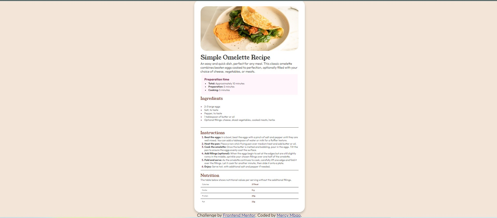

# Frontend Mentor - Recipe page solution

This is a solution to the [Recipe page challenge on Frontend Mentor](https://www.frontendmentor.io/challenges/recipe-page-KiTsR8QQKm). Frontend Mentor challenges help you improve your coding skills by building realistic projects. 

## Table of contents

- [Overview](#overview)
  - [The challenge](#the-challenge)
  - [Screenshot](#screenshot)
  - [Links](#links)
- [My process](#my-process)
  - [Built with](#built-with)
  - [What I learned](#what-i-learned)
  - [Continued development](#continued-development)
  - [Useful resources](#useful-resources)
- [Author](#author)
- [Acknowledgments](#acknowledgments)


## Overview
A simple omelette recipe, including a preparation time, an ingredient list, step-by-step instructions, and a bonus tip on its nutritional value

### Screenshot



### Links
- Live Site URL: [vercel](https://recipe-page-lemon-kappa.vercel.app/)

## My process

### Built with

- Semantic HTML5 markup
- CSS custom properties
- Flexbox
- CSS Grid
- [Styled Components](https://styled-components.com/) - For styles


### What I learned

To see how you can add code snippets, see below:

```html
<article><h1>Some HTML code I'm proud of</h1></article>
```
```css
.recipe-step ol li::marker{
    color:  hsl(332, 51%, 32%);
    font-weight: bold;
}
```
```

```

If you want more help with writing markdown, we'd recommend checking out [The Markdown Guide](https://www.markdownguide.org/) to learn more.

**Note: Delete this note and the content within this section and replace with your own learnings.**

### Continued development

Use this section to outline areas that you want to continue focusing on in future projects. These could be concepts you're still not completely comfortable with or techniques you found useful that you want to refine and perfect.

**Note: Delete this note and the content within this section and replace with your own plans for continued development.**

### Useful resources

- [Example resource 1](https://www.example.com) - This helped me for XYZ reason. I really liked this pattern and will use it going forward.
- [Example resource 2](https://www.example.com) 

## Author

- Website - [vercel](https://recipe-page-lemon-kappa.vercel.app/)
- Frontend Mentor - [@mercie-ux](https://www.frontendmentor.io/profile/mercie-ux)
- Twitter - [@junearsenic7](https://www.twitter.com/junearsenic7)


## Acknowledgments
frontend mentor

